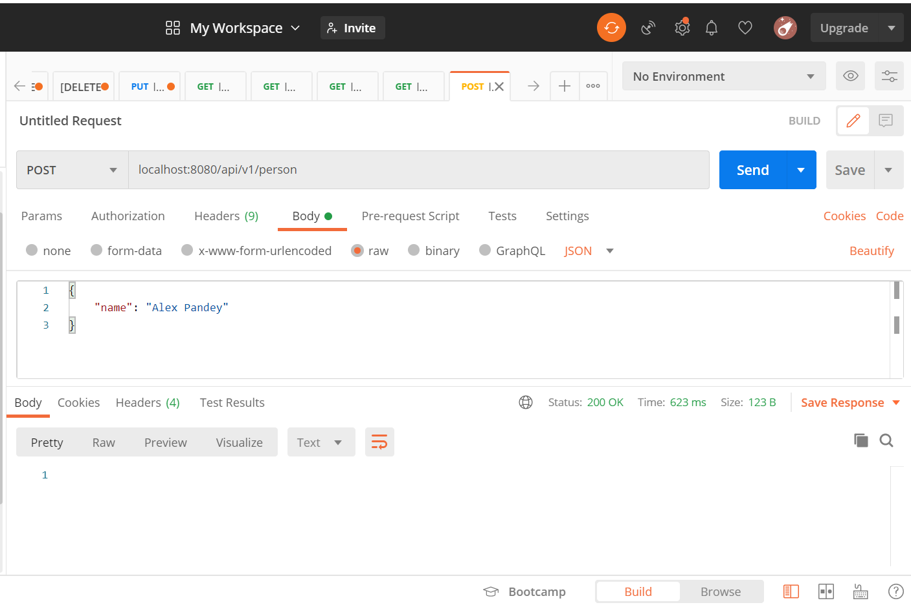
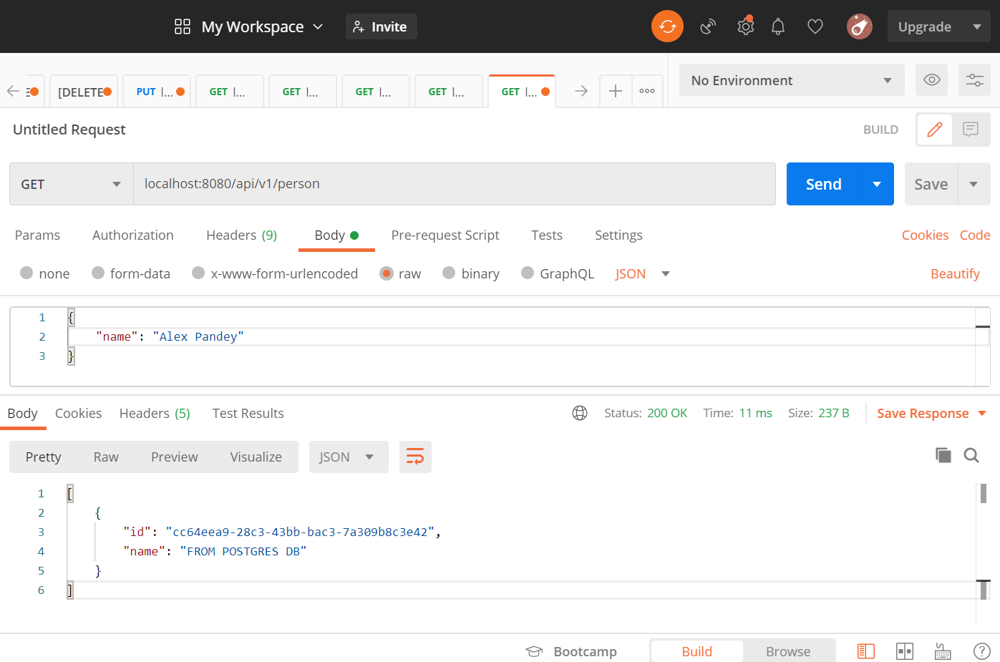
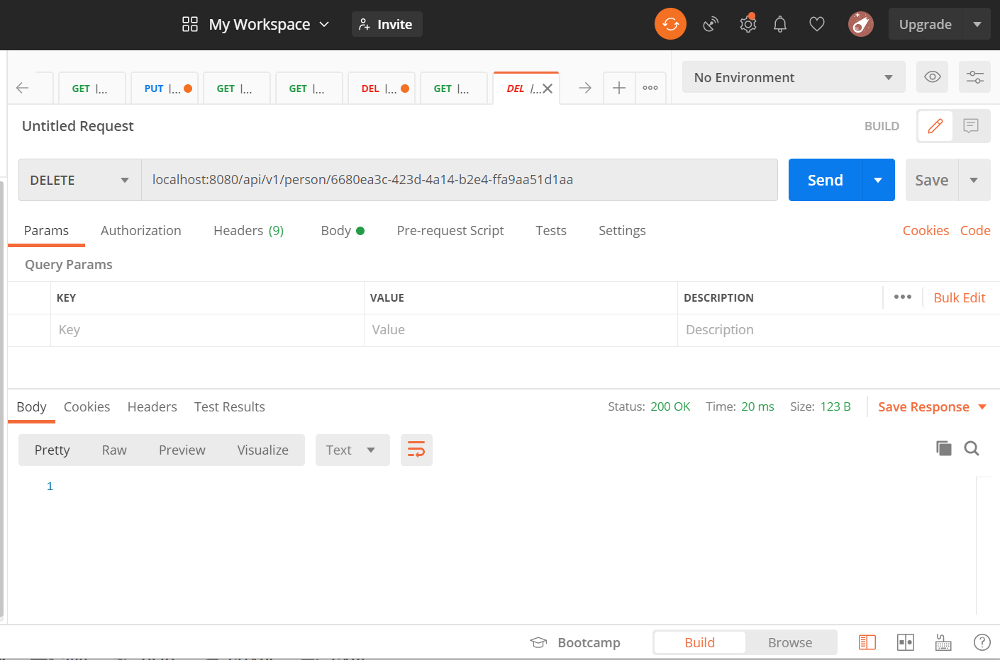

# REST-APIs-Using-Spring-Boot-and-Postman

1) Used this website for installing project and dependencies [Spring-Boot](https://start.spring.io/)
 
2) The overall process of Client's requests and their response from Database is as follows:

3) Now we created REST APIs using Spring Boot and tested them Using Postman and created 
   request Mappings for HTTP methods using Define Path (localhost:8080/api/v1/person)

4) In Postman we're sending POST request and and Pass the Data in body section in JSON format which is as follows:

5) After Sucesfully sending Post request, To retrive the number of people from database used GET method which as follows:

6) We used PUT method to update the Person name using thier Id's which are as follows:

7) At last, We used DELETE method for deleting the person from their Id which is as follows:

8) Connecting to Postgres DB: (https://hub.docker.com/_/postgres)
- fist we install Docker and Starting the Postgres instance using following commands:
- docker run -d -p 80:80 docker/getting-started   (server on port 80)
- docker pull postgres:alpine     (downloading the image)
- docker images    (display the image)
- docker run --name postgres-spring -e POSTGRES_PASSWORD=password -d -p 5432:5432 postgres:alpine (start a psotgres instance)
- docker ps (to display the name of container ie postgres spring)
- docker port postgres-spring (we're exposing the container port to the outside world on localhost and 5432)

9) Creating a Postgres Database using Docker commnands
- docker exec -it e5e88cf822e8 bin/bash  (from this we can go to inside of container and write it dwon psql commnads)
- bash-5.1# psql
- bash-5.1# psql -U postgres

10) Now we're under postgres user name
- postgres=# \l      (it will show list of database)
- postgres=# CREATE DATABASE demodb    (creating new database demodb)
- postgres=# \c demodb    (You are now connected to database "demodb" as user "postgres")
- demodb=# \d, demodb=# \dt    (find a relation between two tables) we find two tables one is person and second is flyway
- demo=# \d person    (shows the details of person table)
- demo=# SELECT * FROM Person;
- demo=# CREATE EXTENSION "uuid-ossp";   (Create extension to generate the id)
- demo=# SELECT uuid_generate_v4();

11) We're inserting values into the table
- demo=# INSERT INTO person (id, name) VALUES (uuid_generate_v4(), 'Maria Jones');
- demo=# INSERT INTO person (id, name) VALUES (uuid_generate_v4(), 'Tom Smith');
- demo=# SELECT * FROM person;

12) We've maange to connect our database using springboot.(Docker, Postgres, flyway, spring jdbc)
